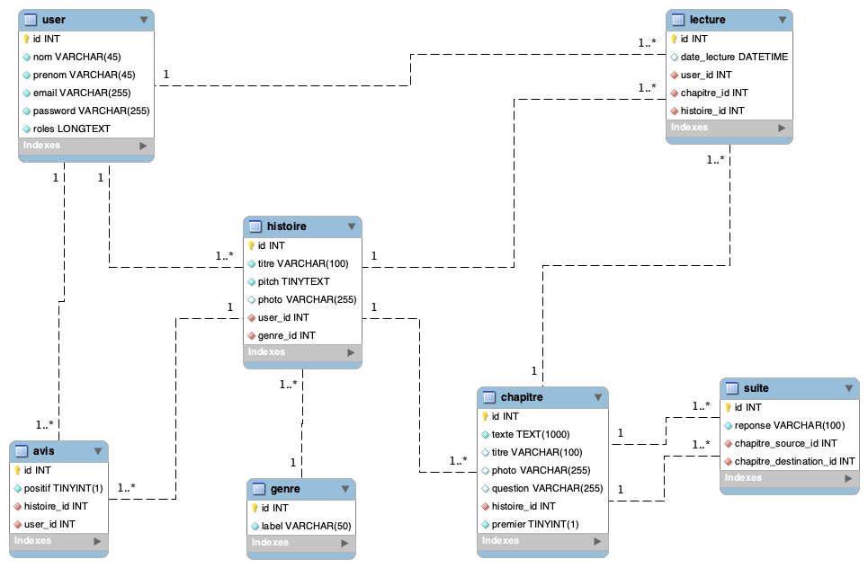

# Projet Marathon Symfony

*   Le projet contient une base Symfony 4.2
*   Les entités du système d'information données dans la figure suivante :

     

*   Un contrôleur `SecurityController` qui contrôle l'accès aux pages protégées.
*   Un contrôleur `RegistrationController` qui permet d'ajouter un utilisateur.
*   Un contrôleur `VisualisationController` qui affiche la page d'accueil.
*   Un contrôleur `CreationController` qui permet de 
    -   Créer une histoire (après connexion).
    -   Créer un chapitre (après connexion).
    -   Créer une liaison entre chapitres (après connexion).
    
# Configuration

*   Le fichier `.env` contient les informations pour utiliser la base de données sur la machine **`marathon`**.
    Si vous souhaitez utiliser votre propre base de données pendant la phase de développement, faites une
    copie du fichier `.env` dans un fichier `.env.local` et modifiez les informations de connexion pour utiliser votre base de données.
    
# Utilisation de la commande git

*   Toujours faire un `git pull` avec de faire un `git push` pour éviter les conflits ...
    
 